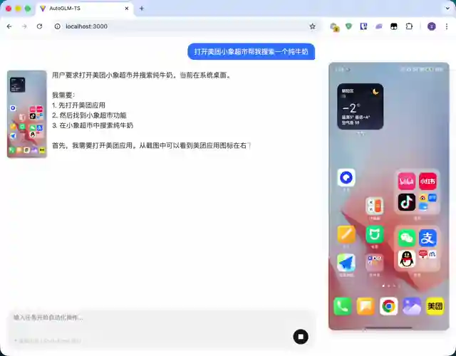

# AutoGLM-TS



TypeScript 实现的 [Open-AutoGLM](https://github.com/openinterpreter/open-autoglm) Android Agent。

```bash
npm start # Web 模式
npm start -- "打开美团的小象超市搜索纯牛奶" # CLI 模式
```

## 快速开始

### 步骤 1: 准备 Android 设备

连接手机：
1. 用 USB 线连接手机到电脑
2. 在手机上启用 USB 调试：设置 → 开发者选项 → USB 调试
3. 点击允许计算机调试

安装 ADB 工具：
```bash
# macOS
curl -L -o platform-tools.zip https://dl.google.com/android/repository/platform-tools-latest-darwin.zip
unzip -j platform-tools.zip "platform-tools/adb" -d /usr/local/bin/

# Linux: 将 darwin 改为 linux
# Windows: 将 darwin 改为 windows
```

验证连接：
```bash
adb devices  # 应该看到你的设备
```

手机安装 ADB Keyboard 输入法：
```bash
curl -L -o ADBKeyboard.apk https://github.com/senzhk/ADBKeyBoard/raw/master/ADBKeyboard.apk
adb install ADBKeyboard.apk
```

在手机设置中启用：设置 → 语言与输入法 → 虚拟键盘 → 选择 ADB Keyboard

### 步骤 2: 安装项目并运行

检查 Node.js（需要 >= 24.x）：
```bash
node --version
```

克隆仓库：
```bash
git clone https://github.com/wangzexi/AutoGLM-TS.git
cd AutoGLM-TS
npm install
```

配置环境变量：
```bash
cp .env.example .env # 创建 .env，填入 API 密钥（https://open.bigmodel.cn）
```

运行项目：
```bash
npm start # Web UI

npm start -- "打开美团的小象超市搜索纯牛奶" # 或 CLI 模式

npm run dev # 或开发模式（代码热重载）
```

## 环境变量详解

> **提示**：使用 `.env.example` 作为模板，复制为 `.env` 后编辑。

| 变量 | 说明 | 必需 | 示例 |
|------|------|------|------|
| `AUTOGLM_BASE_URL` | LLM API 服务地址 | ✅ | `https://open.bigmodel.cn/api/paas/v4` |
| `AUTOGLM_MODEL` | 手机自动化模型 | ✅ | `autoglm-phone` |
| `AUTOGLM_GENERAL_MODEL` | 通用任务模型（技能总结等） | ❌ | `glm-4-flash`（默认） |
| `AUTOGLM_API_KEY` | API 认证密钥 | ✅ | 从服务商获取 |
| `AUTOGLM_MAX_STEPS` | 单次任务最大执行步数 | ❌ | `100`（默认） |

## 许可证

Apache License 2.0 - 详见 [LICENSE](./LICENSE) 文件
